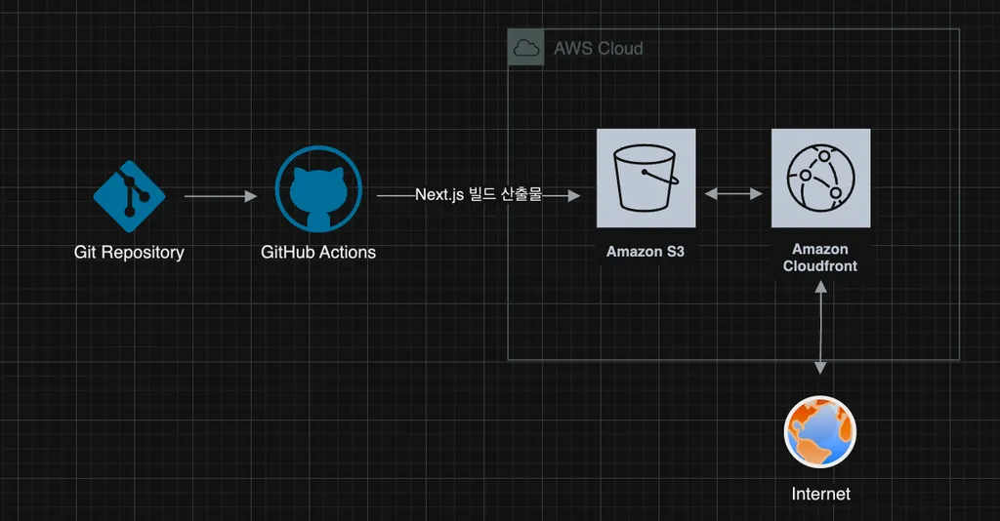
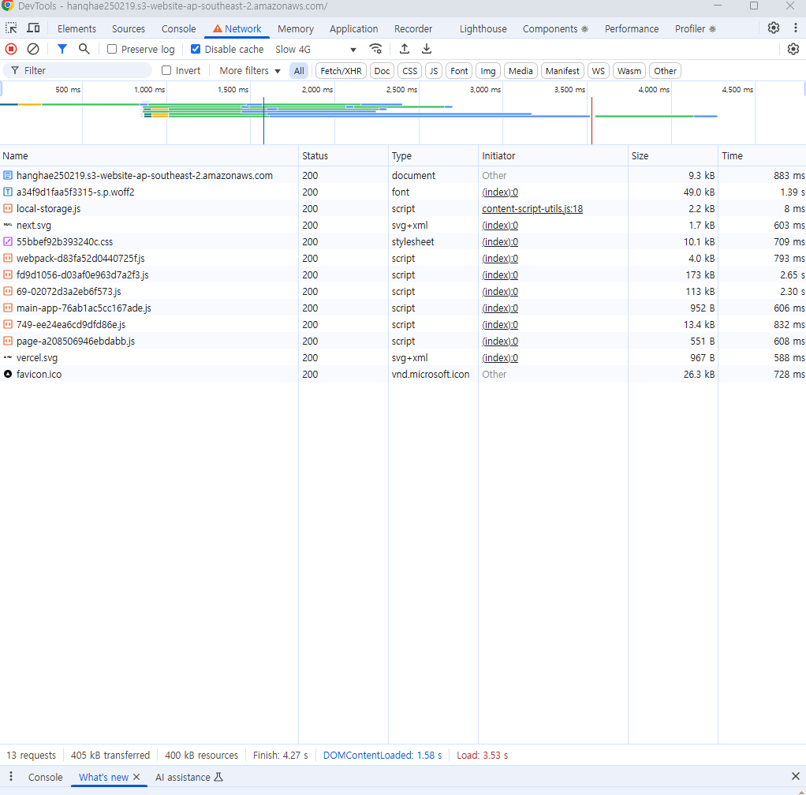
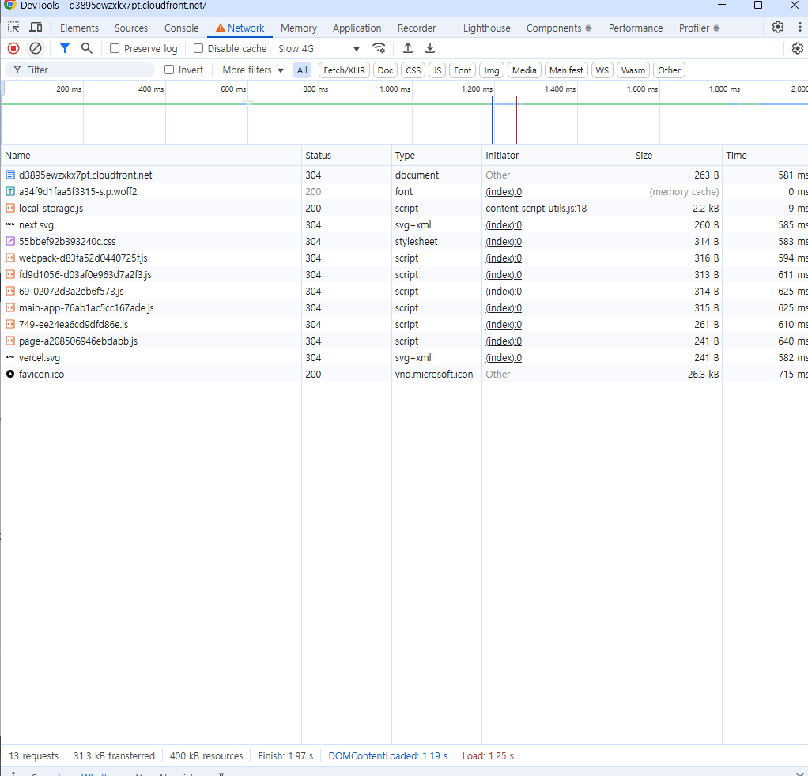

# NextJS 프로젝트 배포 과제

## 개요

### 배포 파이프라인 다이어그램

### 워크플로우

- 트리거: main 브랜치에 push 될 때, 수동 실행

- 작업 단계

  0. 최신 우분투 환경에서 실행됨

  1. 저장소 코드를 워크플로우 환경으로 가져옴

  2. `npm ci`로 package-lock.json 기반 정확한 버전 설치

  3. Next.js 프로젝트 빌드해서 /out 디렉토리에 정적 파일 생성

  4. GitHub Secrets를 통해 AWS 인증 설정

  5. 3번의 정적 파일을 S3 배포

  6. CloudFront 캐시 무효화

## 주요 링크

- S3 버킷 웹사이트 엔드포인트: http://hanghae250219.s3-website-ap-southeast-2.amazonaws.com/
- CloudFrount 배포 도메인 이름: https://d3895ewzxkx7pt.cloudfront.net

## 주요 개념

### GitHub Actions과 CI/CD 도구

자동화 워크플로우를 위한 도구, GitHub 저장소에서 직접 코드를 빌드/테스트/배포할 수 있음, YAML 파일로 정의

### S3와 스토리지

Object 기반 저장공간을 제공, 정적 웹 호스팅과 버전 관리 기능을 제공

디렉토리와 유사한 개념인 Bucket이 존재함, 무제한 저장 용량

- 객체(Object): 실제 저장되는 파일과 메타데이터
- 키(Key): 버킷 내에서 객체를 식별하는 고유 식별자

### CloudFront와 CDN

CDN: 분산된 서버 네트워크를 통해 콘텐츠를 사용자와 가까운 위치에서 전송하는 시스템

CloudFront: AWS CDN 서비스, 엣지 로케이션을 통해 콘텐츠 전송, 사용자와 가까운 엣지에서 콘텐츠 제공, HTTPS 지원

- Edge Location: 컨텐츠들이 캐시에 보관되는 장소

- Origin: 원래 컨텐츠들이 들어있는 곳(S3, EC2인스턴스 등)

### 캐시 무효화(Cache Invalidation)

CloudFront의 엣지 로케이션에 저장된 캐시를 강제로 삭제해 새로운 콘텐츠를 가져오게 하는 기능, 비용 발생할 수 있음

### Repository secret과 환경변수

저장소 설정에서 관리되는 암호화된 환경변수, GitHub Actions 워크플로우에서 사용

현재 프로젝트에서는 S3, cloudfront, access 관련 키를 관리

## 성능 분석

- S3
  

- cloudfront
  

| 항목                          | S3     | CloudFront + S3 |
| ----------------------------- | ------ | --------------- |
| TTFB                          | 883ms  | 581ms           |
| First Contentful Paint(FCP)   | 1.58s  | 1.19s           |
| Largest Contentful Paint(LCP) | 4.27s  | 1.97s           |
| Total Requests                | 13     | 13              |
| Total Transfer Size           | 405 kB | 31.3 kB         |

FCP와 LCP가 더 빠르며 요청수는 동일해도 전송 크기가 더 작다.

따라서 cloudfront가 전반적으로 더 성능이 우수하다.
